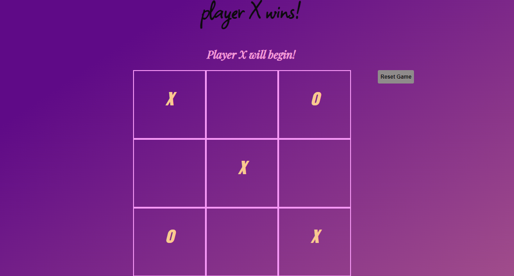

# 📊 Tic-Tac-Toe

### Goal: Create a two player Tic-Tac-Toe game. The users should be able to click to place their X or O and if they win the program should mention their win in the DOM. Please make the game as OOP as possible.

This project embodies a user friendly tic-tac-toe game, allowing 2 users to compete against one another until someone wins or there is a draw!

**Link to project: ** 

## How It's Made:

**Tech used:** HTML, CSS, JavaScript

I utilized my skills in javaScript, HTML and CSS to style this game in way that satisfied OOP. In doing this, I utilized Abstraction ( of the four pillars) by condensing the entire game into a single object and adding multiple methods and Event Listeners to asisst with user interaction.

## Lessons Learned:
I learned how to take an HTML element from the document and turning them into an array. In doing this I was able to compare the "winning-array combinations" with the user's moves.